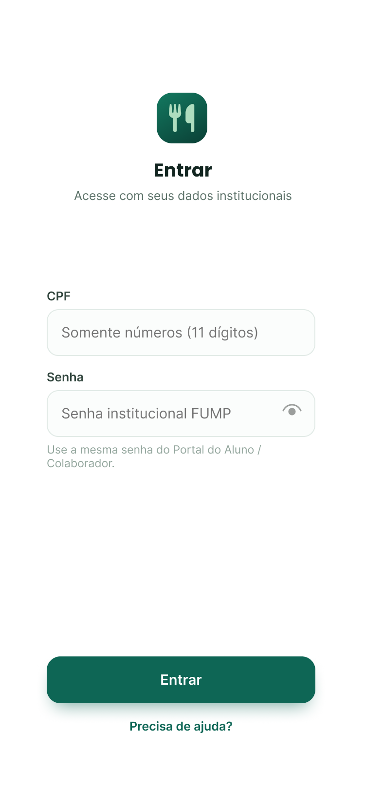
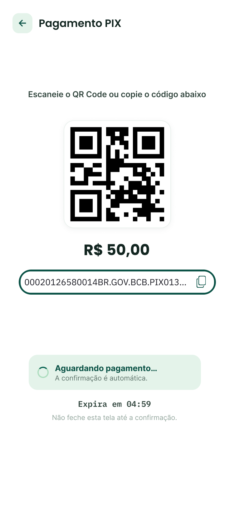
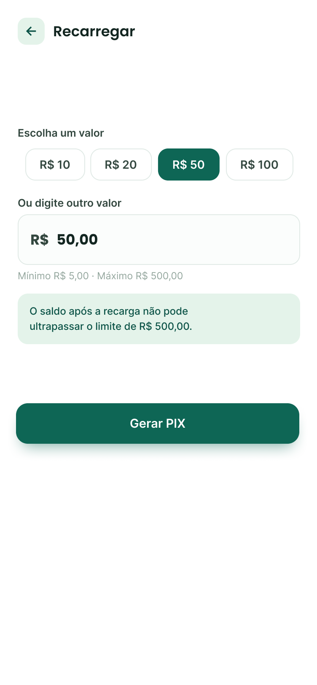
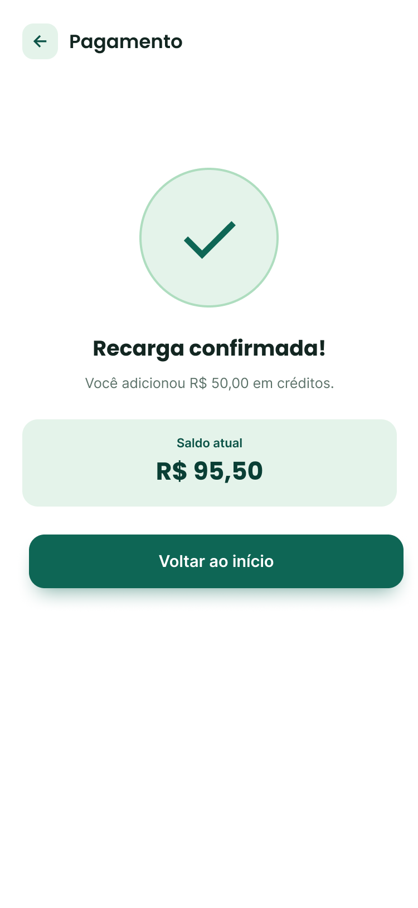
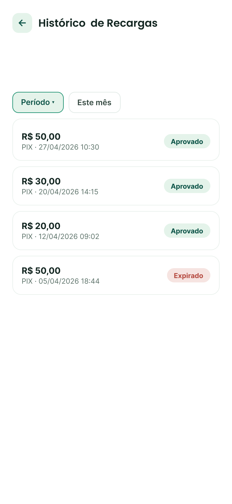
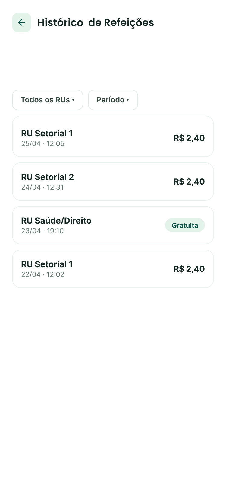
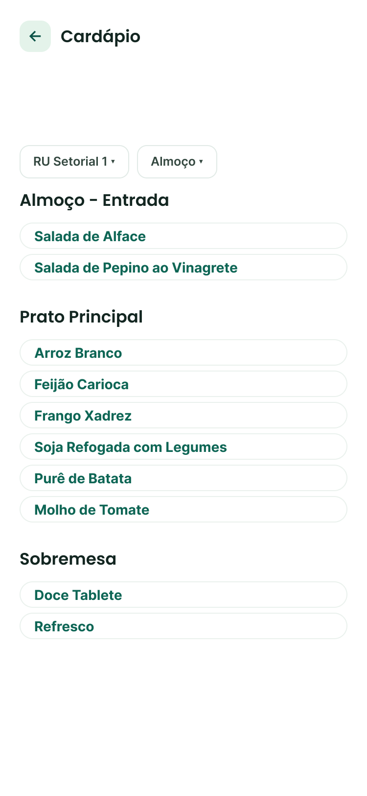
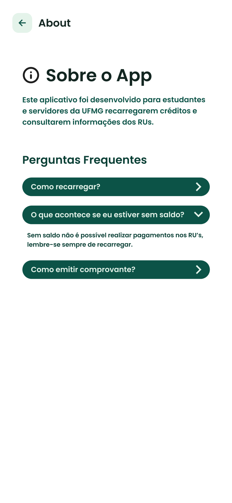

<div align="center">
  

  # InovaRU

  **Recarga e consulta de créditos dos Restaurantes Universitários da UFMG**

  <p>Aplicativo mobile desenvolvido para o Hackathon InovaRU - DACompSI/UFMG, DCC/UFMG e FUMP.</p>
</div>

---

## Sobre o projeto

O InovaRU é um aplicativo mobile criado para o Hackathon InovaRU UFMG. A proposta é reduzir filas nos Restaurantes Universitários da UFMG, permitindo que estudantes consultem saldo, façam recargas de créditos pelo próprio celular e se organizem para recarregar com antecedência.

O projeto foi pensado para induzir o comportamento de recarga antecipada e reduzir problemas recorrentes na fila, como espera excessiva, instabilidade de conexão no local e pagamentos feitos apenas no momento da refeição. Para isso, o app inclui notificações personalizáveis, configuradas por cada usuário de acordo com sua necessidade.

Este repositório contém o frontend do aplicativo e um mock local da API. A API oficial deverá ser fornecida pela FUMP e substituir o mock futuramente.

## Contexto do Hackathon

O Hackathon InovaRU faz parte de uma atividade de extensão e desenvolvimento tecnológico da UFMG, apoiada pelo Edital de Apoio a Iniciativas e Projetos do 1º Semestre de 2026 (DACompSI/UFMG), em parceria com o Departamento de Ciência da Computação (DCC/UFMG) e a Fundação Universitária Mendes Pimentel (FUMP).

Segundo o edital, o objetivo geral é desenvolver um protótipo de aplicativo móvel integrado a um sistema de recarga e débito de créditos para uso exclusivo nos Restaurantes Universitários da UFMG. O impacto esperado é combater longas filas, otimizar o tempo dos estudantes e modernizar o acesso às refeições utilizando o registro acadêmico.

A solução deve consumir uma API RESTful da FUMP com fluxo de autenticação, consulta de saldo e geração de pagamentos via PIX (MercadoPago). O backend institucional previsto no edital é Node.js com Express.js, conectado a um banco SQL Server. Neste projeto, implementamos o app mobile e um mock local da API para viabilizar o desenvolvimento e a demonstração enquanto a API final não está disponível.

## Funcionalidades

- Login de usuário
- Consulta de saldo de créditos
- Recarga de saldo
- Geração de pagamento via PIX
- Acompanhamento de status do pagamento
- Histórico de recargas
- Histórico de refeições
- Cardápio dos Restaurantes Universitários
- Configuração de notificações personalizáveis
- Monitoramento de saldo baixo
- Cache local e cache de requisições para melhorar a experiência do usuário

## Screenshots

A jornada principal do app — login, consulta de saldo, pagamento via PIX e confirmação da recarga:

<p align="center">
  
  
  
  
</p>

<details>
<summary>Ver todas as telas</summary>

<p align="center">
  
  
  
  
  
  
  
</p>

</details>

## Tecnologias

**Core**
- Expo 54
- React Native 0.81
- TypeScript
- Expo Router

**Dados e estado**
- React Query (`@tanstack/react-query`) - cache, revalidação e paginação de dados remotos
- Zustand - estado global da aplicação
- AsyncStorage / Expo Secure Store - persistência local

**UI e estilização**
- Emotion Native
- Expo Image, Expo Blur, Expo Symbols

**Notificações e tarefas em segundo plano**
- Expo Notifications
- Expo Background Task / Expo Task Manager

**Ambiente de desenvolvimento**
- Mockoon CLI - mock local da API

## Estrutura do projeto

```text
app/                  Rotas do Expo Router
src/_app/             Bootstrap, providers e layout raiz do app
src/features/         Features da aplicação
src/shared/           Componentes, tema, API, storage e utilitários compartilhados
mock/api.json         Mock local da API usado durante desenvolvimento
mock/README.md        Exemplos de endpoints disponíveis no mock
```

## Requisitos

- Node.js instalado
- npm instalado
- Android Studio/emulador Android ou dispositivo físico Android
- Dev client do Expo configurado no dispositivo/emulador

> O projeto usa `expo-dev-client`. Para rodar o app, utilize `npx expo start --dev-client --clear`.

## Instalação

Instale as dependências:

```powershell
npm install
```

## Rodando com o mock

O mock local usa Mockoon e fica em `mock/api.json`. Ele existe apenas para desenvolvimento e demonstração no hackathon. Futuramente, o app deve apontar para a API real da FUMP.

Abra um terminal e rode o mock:

```powershell
npm run mock
```

Em outro terminal, configure a URL da API e inicie o Expo:

```powershell
$env:EXPO_PUBLIC_API_URL="http://192.168.68.105:3000"
```
```powershell
npx expo start --dev-client --clear
```

Se estiver usando outro computador, rede ou IP local, troque `192.168.68.105` pelo IP da máquina que está rodando o mock. O celular e o computador precisam estar na mesma rede.

**Como encontrar esse IP:**

- **Windows:** rode `ipconfig` e procure o campo `Endereço IPv4` dentro da seção `Adaptador de Rede sem Fio Wi-Fi` (ou `Adaptador Ethernet`, se estiver usando cabo).
- **macOS/Linux:** rode `ifconfig` e procure o campo `inet` na interface de rede correspondente (geralmente `en0` no Wi-Fi do macOS, ou `wlan0`/`eth0` no Linux).

### Usando `.env` local

Como alternativa, você pode criar um arquivo `.env.development.local` na raiz do projeto:

```env
EXPO_PUBLIC_API_URL=http://192.168.68.105:3000
```

Depois, inicie o Expo:

```powershell
npx expo start --dev-client --clear
```

Arquivos `.env*.local` estão no `.gitignore`, então essa configuração fica apenas na sua máquina.

## API e mock

A URL base usada pelo app vem da variável:

```text
EXPO_PUBLIC_API_URL=http://192.168.68.105:3000
```

Se essa variável não for informada, o app usa os fallbacks definidos em `src/shared/api/apiConfig.ts`:

- Android: `http://10.0.2.2:3000`
- Demais plataformas: `http://localhost:3000`

Endpoints principais disponíveis no mock:

- `POST /usuarios/login`
- `GET /creditos/refeicoes`
- `GET /creditos/recargas`
- `GET /creditos/saldo`
- `POST /creditos/pagamento`
- `GET /creditos/pagamento/:paymentId/status`

Quando a API oficial da FUMP estiver disponível, a expectativa é substituir a URL do mock pela URL real da API, mantendo os contratos definidos para autenticação, saldo, recargas e pagamentos.

## Cache

O app utiliza cache para melhorar a experiência e reduzir chamadas desnecessárias:

- React Query mantém dados de saldo, pagamento e status de pagamento em memória.
- O saldo de recarga usa `staleTime: Infinity`, evitando refetch automático enquanto o app considera o dado válido.
- Após um pagamento aprovado, o app atualiza o saldo em cache localmente.
- Configurações de notificação e monitoramento de saldo usam AsyncStorage para persistência local.

## Scripts

```powershell
npm run mock      # inicia o mock local da API
npm run start     # inicia o Expo
npm run android   # inicia o Expo para Android
npm run ios       # inicia o Expo para iOS
npm run web       # inicia o Expo para web
npm run lint      # executa o lint do projeto
```

Para o fluxo principal de desenvolvimento com dev client, prefira:

```powershell
npx expo start --dev-client --clear
```

## Licença

Este projeto está licenciado sob os termos da [MIT License](./LICENSE).

## Colaboradores

- [Letícia Braga](https://github.com/lbresteves)
- [Gabriel](https://github.com/GabrielRCMendonca)
- [Saulo](https://github.com/jlzht)
- [João](https://github.com/JFCalvao)
